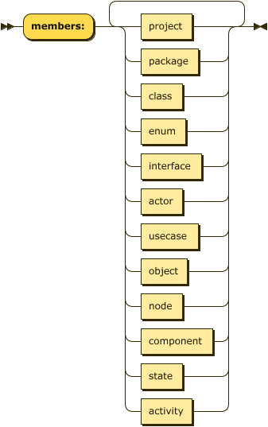

# UST_UML_TOOL  
Universo Santa Tecla  
[uSantaTecla@gmail.com](mailto:uSantaTecla@gmail.com)  

**Índice**  

1. [Modelo del dominio](#modelo-del-dominio)  
   1.1. [Lenguaje](#lenguaje)  
      1.1.1. [Sintaxis](#sintaxis)  
      1.1.2. [Ejemplos Comandos](#ejemplos-comandos)  
2. [Requisitos](#requisitos)  
   2.1. [Actores y casos de uso](#actores-y-casos-de-uso)  
   2.2. [Contexto](#contexto)  
   2.3. [Prototipo de Interfaz](#prototipo-de-interfaz)  
3. [Analisis](#analisis)  
   3.1. [Casos de uso](#casos-de-uso)  
      3.1.1. [Add Member](#add-member)  
      3.1.2. [Add Relation](#add-relation)  
4. [Diseño](#diseño)  
   4.1. [Vista de Despliegue](#vista-de-despliegue)  
   4.2. [Trazabilidad Analisis/Diseño](#trazabilidad-analisis/diseño)  

## Modelo del dominio  
  
  

### Lenguaje  

#### Sintaxis  
* * *
<a name="UST_UML">UST_UML:</a>

<map name="UST_UML.map"><area shape="rect" coords="49,1,157,33" href="#addCommand" title="addCommand"><area shape="rect" coords="49,45,161,77" href="#deleteComand" title="deleteComand"><area shape="rect" coords="49,89,175,121" href="#modifyCommand" title="modifyCommand"><area shape="rect" coords="49,133,165,165" href="#openCommand" title="openCommand"><area shape="rect" coords="49,177,165,209" href="#closeCommand" title="closeCommand"></map>

no references

<a name="addCommand">addCommand:</a>

<map name="addCommand.map"><area shape="rect" coords="119,33,197,65" href="#members" title="members"><area shape="rect" coords="257,33,333,65" href="#relations" title="relations"><area shape="rect" coords="393,33,447,65" href="#users" title="users"></map>

referenced by:

*   [UST_UML](#UST_UML "UST_UML")

<a name="members">members:</a>

<map name="members.map"><area shape="rect" coords="177,17,241,49" href="#project" title="project"><area shape="rect" coords="177,61,249,93" href="#package" title="package"><area shape="rect" coords="177,105,229,137" href="#class" title="class"><area shape="rect" coords="177,149,233,181" href="#enum" title="enum"><area shape="rect" coords="177,193,253,225" href="#interface" title="interface"><area shape="rect" coords="177,237,229,269" href="#actor" title="actor"><area shape="rect" coords="177,281,249,313" href="#usecase" title="usecase"><area shape="rect" coords="177,325,235,357" href="#object" title="object"><area shape="rect" coords="177,369,229,401" href="#node" title="node"><area shape="rect" coords="177,413,267,445" href="#component" title="component"><area shape="rect" coords="177,457,229,489" href="#state" title="state"><area shape="rect" coords="177,501,241,533" href="#activity" title="activity"></map>

referenced by:

*   [addCommand](#addCommand "addCommand")

<a name="class">class:</a>

<map name="class.map"><area shape="rect" coords="107,1,183,33" href="#identifier" title="identifier"><area shape="rect" coords="223,33,301,65" href="#modifiers" title="modifiers"><area shape="rect" coords="361,33,469,65" href="#classMembers" title="classMembers"><area shape="rect" coords="529,33,605,65" href="#relations" title="relations"></map>

referenced by:

*   [members](#members "members")

<a name="identifier">identifier:</a>

referenced by:

*   [class](#class "class")
*   [member](#member "member")
*   [relations](#relations "relations")
*   [type](#type "type")

<a name="modifiers">modifiers:</a>

<map name="modifiers.map"><area shape="rect" coords="157,33,213,65" href="#public" title="public"><area shape="rect" coords="157,77,229,109" href="#package" title="package"></map>

referenced by:

*   [class](#class "class")

<a name="classMembers">classMembers:</a>

<map name="classMembers.map"><area shape="rect" coords="157,17,229,49" href="#member" title="member"></map>

referenced by:

*   [class](#class "class")

<a name="member">member:</a>

<map name="member.map"><area shape="rect" coords="419,1,467,33" href="#type" title="type"><area shape="rect" coords="487,1,563,33" href="#identifier" title="identifier"><area shape="rect" coords="327,121,375,153" href="#type" title="type"><area shape="rect" coords="395,121,471,153" href="#identifier" title="identifier"><area shape="rect" coords="577,121,625,153" href="#type" title="type"><area shape="rect" coords="645,121,721,153" href="#identifier" title="identifier"></map>

referenced by:

*   [classMembers](#classMembers "classMembers")

<a name="type">type:</a>

<map name="type.map"><area shape="rect" coords="49,265,125,297" href="#identifier" title="identifier"></map>

referenced by:

*   [member](#member "member")

<a name="relations">relations:</a>

<map name="relations.map"><area shape="rect" coords="125,1,201,33" href="#identifier" title="identifier"><area shape="rect" coords="215,45,291,77" href="#identifier" title="identifier"></map>

referenced by:

*   [addCommand](#addCommand "addCommand")
*   [class](#class "class")

* * *

### Ejemplos Comandos  
*Package Context*  
<pre>
add:  
  members:  
    - class: myClass  
      members:  
        - member: private int attribute  
        - member: public string method(Type param1, int param2)  
      relations:  
        - composition: AnotherClass  
        - aggregation: AnotherClass2  
    - package: myPackage  
  relations:  
    - use: anotherPackage  
</pre>

## Requisitos  

### Actores y Casos de uso  
  

### Contexto  
  

### Prototipo de interfaz  
  
  

## Analisis  
  

### Add Member  
  

### Add Relation  
  
 
## Diseño  

### Vista de despliegue  
  

### Trazabilidad Analisis/Diseño 
  
